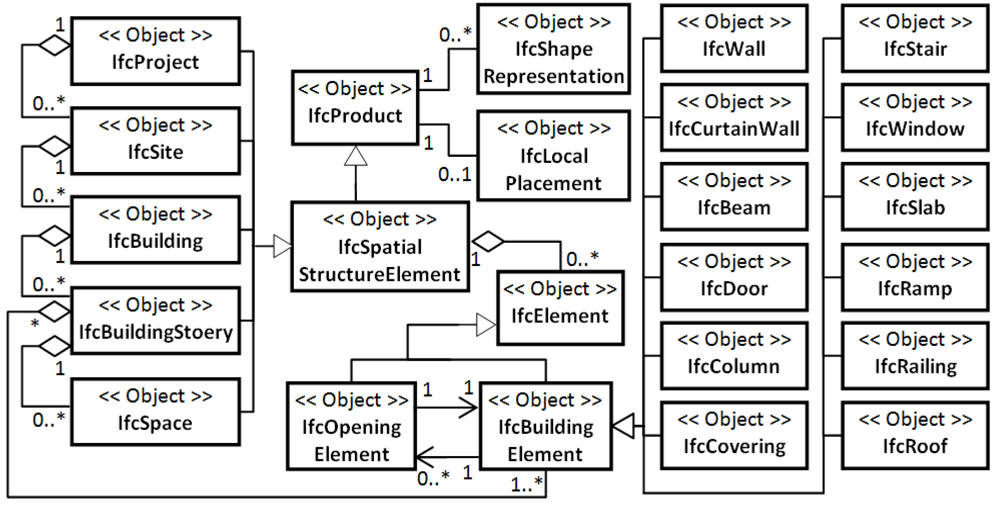

IFC Spatial Elements
------------------

IFC is an object oriented data model. It consists internally on a open reference model based on STEP. 

The most generic location concept in IFC is [*IfcProduct*](http://www.buildingsmart-tech.org/ifc/IFC2x3/TC1/html/ifckernel/lexical/ifcproduct.htm) with the newer subclass [*IfcSpatialStructureElement*](http://www.buildingsmart-tech.org/ifc/IFC2x3/TC1/html/ifcproductextension/lexical/ifcspatialstructureelement.htm). From this further spatial elements derive. The fundamental location elements in IFC are:

* [*IfcProject*](http://www.buildingsmart-tech.org/ifc/IFC2x3/TC1/html/ifckernel/lexical/ifcproject.htm): Refering to a project, i.e. the name space for an IFC file 

* [*IfcSite*](http://www.buildingsmart-tech.org/ifc/IFC2x3/TC1/html/ifcproductextension/lexical/ifcsite.htm): A specific site within a projet, such as a campus

* [*IfcBuilding*](http://www.buildingsmart-tech.org/ifc/IFC2x3/TC1/html/ifcproductextension/lexical/ifcbuilding.htm): A single building within a site

* [*IfcBuildingStorey*](http://www.buildingsmart-tech.org/ifc/IFC2x3/TC1/html/ifcproductextension/lexical/ifcbuildingstorey.htm): A storey in a building

* [*IfcSpace*](http://www.buildingsmart-tech.org/ifc/IFC2x3/TC1/html/ifcproductextension/lexical/ifcspace.htm): A specific area within a storey including areas, rooms and zones. No explicit concepts for a room exist. This results from the fact that particular office buildings are designed and constructed without a specific room layout. A Room is therefore a post-occupancy concep and not a design concept. Spaces can be nested up to three levels in IFC. The three levels can be interpreted as: (i) a building section (east block); (ii) a room within a section; (iii) a zone or axis within a room. Other interpretations are possible.

The IFC spatial hierachy is therefore represenatable as:
*IfcProject* > *IfcSite* > *IfcBuilding* > *IfcBuildingStorey* > *IfcSpace1* > *IfcSpace2* > *IfcSpace3*

The spatial elements may have additional properties defining attributes such as dimensions, size, label, etc.

Beside these spatial elements also other concrete build elements can be defined in IFC such as floor, wall, columns, doors, windows, etc.. They are subconcepts of the generic type [*IfcBuildingElement*](http://www.buildingsmart-tech.org/ifc/IFC2x3/TC1/html/ifcproductextension/lexical/ifcbuildingelement.htm). 

The IFC elements may be referenced by device instances in different ways. A device may directly refer to a [*IfcDistributionControlElement*](http://www.buildingsmart-tech.org/ifc/IFC2x3/TC1/html/ifcsharedbldgserviceelements/lexical/ifcdistributioncontrolelement.htm). The location of the device is then implicitly defined by linking it to other structural elements.

gbXML Spatial Elements
-----------------

gbXML is a XML format that has not such a strong object model as IFC. However, it has a very similar spatial concepts:

* [*Campus*](http://www.gbxml.org/schema/6-01/GreenBuildingXML_Ver6.01.xsd#element_Campus): The Campus element should be used as the base for all physical objects. On a campus, place one or more buildings.

* [*Building*](http://www.gbxml.org/schema/6-01/GreenBuildingXML_Ver6.01.xsd#element_Building): A building

* [*BuildingStorey*](www.gbxml.org/schema/6-01/GreenBuildingXML_Ver6.01.xsd#element_BuildingStorey): Captures Building Storey Structure

* [*Space*](http://www.gbxml.org/schema/6-01/GreenBuildingXML_Ver6.01.xsd#element_Space): A space represents a volume enclosed by surfaces.

* [*Zone*](http://www.gbxml.org/schema/6-01/GreenBuildingXML_Ver6.01.xsd#element_Zone): A subconcept to space

The IFC spatial hierachy in gbXML is therefore defined as:
*Campus* > *Building* > *BuildingStorey* > *Space* > *Zone*

gbXML is not specific in the definition of build elements. Instead of defining walls, doors, or windows explicitely it only has geometrical concepts such as [*PlanarGeometry*](http://www.gbxml.org/schema/6-01/GreenBuildingXML_Ver6.01.xsd#element_PlanarGeometry), [*ShellGeometries*](http://www.gbxml.org/schema/6-01/GreenBuildingXML_Ver6.01.xsd#element_ShellGeometry) and [*SpaceBoundary*](http://www.gbxml.org/schema/6-01/GreenBuildingXML_Ver6.01.xsd#element_SpaceBoundary).

Haystack Spatial Elements
------------------

The spatial definition in Haystack is rudimentary. There are only two spatial concepts:

* [*Site*](http://project-haystack.org/doc/Structure#site): Site: single building
* [*Zone*](http://project-haystack.org/tag/zone): Associated with a conditioned zone of a building.

Location Ontology
-----------------

To combine the different concepts a location ontology was defined that merges the different concepts from IFC and gbXML and extend them by some geospatial and post-design concepts.

The spatial hierachy is adding city to the geospatial level and concrete concepts for room and zone as subconcepts of Space. The related IFC, gbXML, and Haystack concepts are listed

* *Project*: A project name space (ifc:Project)

* *City*: A metropolitan concept

* *Site*: A campus (ifc:Site, gbXML:Campus)

* *Building*: A building (ifc:Building, gbXML:Building, haystack:Building)

* *BuildingStorey*: A building storey (ifc:BuildingStorey, gbXML:BuildingStorey)

* *Space*/*Room*: An enclosed space (ifc:Space, gbXML:Space, haystack:Space)

* *Zone*: A subconcept of a space (gmXML:Zone)

The resulting spatial hierachy is:
*Project* > *City* > *Site* > *Building* > *BuildingStorey* > *Space* > *Zone*

We further define several building elements as connections between spatial elements such as walls, doors, and windows similar to IFC and gbXML.

The full semantic taxonomy is shown below

